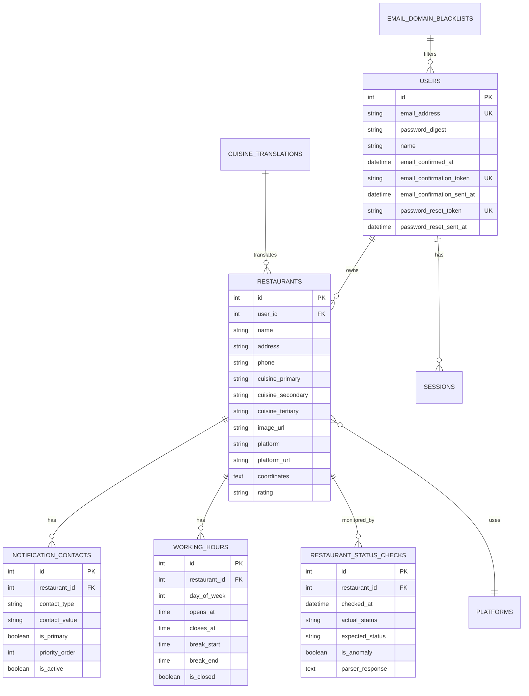

# TrackerDelivery Database Schema v5.5

## Overview

The TrackerDelivery v5.5 database schema consists of 8 core application tables plus Solid Queue job management tables. The schema is optimized for restaurant monitoring, user authentication, and multi-channel notifications with comprehensive historical tracking.

**Database Engine**: SQLite3 with Rails 8.0 ActiveRecord
**Total Tables**: 8 application tables + 12 Solid Queue system tables
**Schema Version**: 20250925084919

## Core Application Tables

### 1. users
User authentication and account management.

**Structure:**
```sql
CREATE TABLE users (
  id INTEGER PRIMARY KEY AUTOINCREMENT,
  email_address VARCHAR NOT NULL,
  password_digest VARCHAR,
  name VARCHAR,
  email_confirmed_at DATETIME,
  email_confirmation_token VARCHAR,
  email_confirmation_sent_at DATETIME,
  password_reset_token VARCHAR,
  password_reset_sent_at DATETIME,
  created_at DATETIME NOT NULL,
  updated_at DATETIME NOT NULL
);
```

**Indexes:**
- `index_users_on_email_address` (unique)
- `index_users_on_email_confirmation_token` (unique)
- `index_users_on_password_reset_token` (unique)

**Model Validations:**
```ruby
class User < ApplicationRecord
  has_secure_password
  
  validates :email_address, presence: true, uniqueness: true, 
            format: { with: URI::MailTo::EMAIL_REGEXP }
  validates :name, presence: true, length: { minimum: 2, maximum: 100 }
  validates :password, length: { minimum: 8 }, if: -> { password.present? }
  
  has_many :restaurants, dependent: :destroy
  has_many :sessions, dependent: :destroy
end
```

**Key Features:**
- **Email Confirmation Flow**: Token-based email verification
- **Password Reset**: Secure token-based password recovery
- **bcrypt Authentication**: Built-in Rails 8 password hashing
- **Session Management**: Multiple active sessions support

---

### 2. sessions
Secure user session management with expiration.

**Structure:**
```sql
CREATE TABLE sessions (
  id INTEGER PRIMARY KEY AUTOINCREMENT,
  user_id INTEGER NOT NULL,
  user_agent VARCHAR,
  ip_address VARCHAR,
  expires_at DATETIME,
  max_lifetime_expires_at DATETIME,
  created_at DATETIME NOT NULL,
  updated_at DATETIME NOT NULL
);
```

**Indexes:**
- `index_sessions_on_user_id`
- `index_sessions_on_updated_at`

**Model Relationships:**
```ruby
class Session < ApplicationRecord
  belongs_to :user
  
  validates :user_id, presence: true
  
  scope :active, -> { where('expires_at > ?', Time.current) }
  scope :expired, -> { where('expires_at <= ?', Time.current) }
  
  def expired?
    expires_at && expires_at <= Time.current
  end
  
  def extend_session!
    self.expires_at = 30.days.from_now
    save!
  end
end
```

**Foreign Keys:**
- `user_id` → `users(id)` (cascade delete)

---

### 3. restaurants
Core restaurant data and platform integration.

**Structure:**
```sql  
CREATE TABLE restaurants (
  id INTEGER PRIMARY KEY AUTOINCREMENT,
  user_id INTEGER NOT NULL,
  name VARCHAR,
  address VARCHAR,
  phone VARCHAR,
  cuisine_primary VARCHAR,
  cuisine_secondary VARCHAR,
  cuisine_tertiary VARCHAR,
  image_url VARCHAR,
  platform VARCHAR NOT NULL,
  platform_url VARCHAR NOT NULL,
  coordinates TEXT,  -- JSON storage
  rating VARCHAR,
  created_at DATETIME NOT NULL,
  updated_at DATETIME NOT NULL
);
```

**Indexes:**
- `index_restaurants_on_user_id`
- `index_restaurants_on_platform`

**Model Validations & Features:**
```ruby
class Restaurant < ApplicationRecord
  belongs_to :user
  has_many :notification_contacts, dependent: :destroy
  has_many :working_hours, dependent: :destroy
  has_many :restaurant_status_checks, dependent: :destroy
  
  # Enums
  enum :platform, { grab: "grab", gojek: "gojek" }
  
  # Validations
  validates :name, presence: true, length: { minimum: 2, maximum: 100 }
  validates :user_id, presence: true
  validates :platform, presence: true, inclusion: { in: platforms.keys }
  validates :platform_url, presence: true
  validate :valid_platform_url
  
  # Scopes
  scope :grab_restaurants, -> { where(platform: "grab") }
  scope :gojek_restaurants, -> { where(platform: "gojek") }
  
  private
  
  def valid_platform_url
    case platform
    when "grab"
      unless platform_url.match?(/r\.grab\.com|grabfood|grab\.com/i)
        errors.add(:platform_url, "is not a valid Grab URL")
      end
    when "gojek"
      unless platform_url.match?(/gofood\.link|gofood\.co\.id|gojek/i)
        errors.add(:platform_url, "is not a valid GoJek/GoFood URL")
      end
    end
  end
end
```

**JSON Fields:**
- `coordinates`: `{ latitude: Float, longitude: Float }`

**Foreign Keys:**
- `user_id` → `users(id)` (cascade delete)

---

### 4. working_hours
Restaurant operating schedule with day-specific configuration.

**Structure:**
```sql
CREATE TABLE working_hours (
  id INTEGER PRIMARY KEY AUTOINCREMENT,
  restaurant_id INTEGER NOT NULL,
  day_of_week INTEGER NOT NULL,  -- 0=Sunday, 1=Monday, etc.
  opens_at TIME,
  closes_at TIME,
  break_start TIME,
  break_end TIME,
  is_closed BOOLEAN DEFAULT FALSE,
  created_at DATETIME NOT NULL,
  updated_at DATETIME NOT NULL
);
```

**Indexes:**
- `index_working_hours_on_restaurant_id`
- `index_working_hours_on_restaurant_id_and_day_of_week` (unique)

**Model Features:**
```ruby
class WorkingHour < ApplicationRecord
  belongs_to :restaurant
  
  # Validations
  validates :restaurant_id, presence: true
  validates :day_of_week, presence: true, inclusion: { in: 0..6 }
  validates :opens_at, :closes_at, presence: true, unless: :is_closed?
  validate :closes_after_opens, unless: :is_closed?
  
  # Scopes
  scope :for_day, ->(day_name) { where(day_of_week: day_name_to_number(day_name)) }
  scope :open_days, -> { where(is_closed: false) }
  scope :closed_days, -> { where(is_closed: true) }
  
  # Class methods
  def self.day_name_to_number(day_name)
    {
      "sunday" => 0, "monday" => 1, "tuesday" => 2,
      "wednesday" => 3, "thursday" => 4, "friday" => 5, "saturday" => 6
    }[day_name.to_s.downcase]
  end
  
  # Instance methods
  def day_name
    %w[Sunday Monday Tuesday Wednesday Thursday Friday Saturday][day_of_week]
  end
  
  def open_time
    opens_at&.strftime("%H:%M")
  end
  
  def close_time
    closes_at&.strftime("%H:%M")
  end
  
  def full_schedule_text
    return "Closed" if is_closed?
    
    schedule = "#{open_time} - #{close_time}"
    if break_start && break_end
      schedule += " (Break: #{break_start.strftime('%H:%M')} - #{break_end.strftime('%H:%M')})"
    end
    schedule
  end
  
  private
  
  def closes_after_opens
    return unless opens_at && closes_at
    errors.add(:closes_at, "must be after opening time") if closes_at <= opens_at
  end
end
```

**Foreign Keys:**
- `restaurant_id` → `restaurants(id)` (cascade delete)

---

### 5. notification_contacts
Multi-channel contact management with priority ordering.

**Structure:**
```sql
CREATE TABLE notification_contacts (
  id INTEGER PRIMARY KEY AUTOINCREMENT,
  restaurant_id INTEGER NOT NULL,
  contact_type VARCHAR NOT NULL,  -- 'telegram', 'whatsapp', 'email'
  contact_value VARCHAR NOT NULL,
  is_primary BOOLEAN DEFAULT FALSE,
  priority_order INTEGER,
  is_active BOOLEAN DEFAULT TRUE,
  created_at DATETIME NOT NULL,
  updated_at DATETIME NOT NULL
);
```

**Indexes:**
- `index_notification_contacts_on_restaurant_id`
- `index_notification_contacts_on_restaurant_id_and_contact_type`
- `index_notification_contacts_on_restaurant_id_and_is_primary`
- `index_notification_contacts_on_restaurant_type_primary`

**Model Features:**
```ruby
class NotificationContact < ApplicationRecord
  belongs_to :restaurant
  
  # Enums
  enum :contact_type, {
    telegram: "telegram",
    whatsapp: "whatsapp", 
    email: "email"
  }
  
  # Validations
  validates :restaurant_id, presence: true
  validates :contact_type, presence: true, inclusion: { in: contact_types.keys }
  validates :contact_value, presence: true
  validates :priority_order, presence: true, 
            uniqueness: { scope: [:restaurant_id, :contact_type] }
  validate :valid_contact_format
  validate :only_one_primary_per_type
  
  # Scopes
  scope :active, -> { where(is_active: true) }
  scope :inactive, -> { where(is_active: false) }
  scope :primary_contacts, -> { where(is_primary: true) }
  scope :ordered, -> { order(:priority_order) }
  
  private
  
  def valid_contact_format
    case contact_type
    when "email"
      unless contact_value.match?(URI::MailTo::EMAIL_REGEXP)
        errors.add(:contact_value, "is not a valid email address")
      end
    when "telegram"
      unless contact_value.match?(/^@\w+$|^\d+$/)
        errors.add(:contact_value, "must be @username or chat_id")
      end
    when "whatsapp"
      unless contact_value.match?(/^\+\d{10,15}$/)
        errors.add(:contact_value, "must be a valid phone number with country code")
      end
    end
  end
  
  def only_one_primary_per_type
    return unless is_primary?
    
    existing = NotificationContact
      .where(restaurant: restaurant, contact_type: contact_type, is_primary: true)
      .where.not(id: id)
    
    errors.add(:is_primary, "only one primary contact per type allowed") if existing.exists?
  end
end
```

---

### 6. restaurant_status_checks
Historical monitoring data with anomaly tracking.

**Structure:**
```sql
CREATE TABLE restaurant_status_checks (
  id INTEGER PRIMARY KEY AUTOINCREMENT,
  restaurant_id INTEGER NOT NULL,
  checked_at DATETIME NOT NULL,
  actual_status VARCHAR NOT NULL,     -- 'open', 'closed', 'error', 'unknown'
  expected_status VARCHAR NOT NULL,   -- 'open', 'closed', 'unknown'
  is_anomaly BOOLEAN DEFAULT FALSE NOT NULL,
  parser_response TEXT,  -- JSON storage of full parser response
  created_at DATETIME NOT NULL,
  updated_at DATETIME NOT NULL
);
```

**Indexes:**
- `index_restaurant_status_checks_on_restaurant_id`
- `index_restaurant_status_checks_on_checked_at`
- `index_restaurant_status_checks_on_is_anomaly`
- `index_restaurant_status_checks_on_restaurant_id_and_checked_at`

**Model Features:**
```ruby
class RestaurantStatusCheck < ApplicationRecord
  belongs_to :restaurant
  
  # Validations
  validates :checked_at, presence: true
  validates :actual_status, presence: true, 
            inclusion: { in: %w[open closed error unknown timeout] }
  validates :expected_status, presence: true,
            inclusion: { in: %w[open closed unknown] }
  validates :is_anomaly, inclusion: { in: [true, false] }
  
  # Scopes
  scope :anomalies, -> { where(is_anomaly: true) }
  scope :recent, ->(time = 24.hours.ago) { where("checked_at > ?", time) }
  scope :for_restaurant, ->(restaurant) { where(restaurant: restaurant) }
  scope :for_status, ->(status) { where(actual_status: status) }
  scope :errors, -> { where(actual_status: "error") }
  
  # Instance methods
  def anomaly_description
    return nil unless is_anomaly?
    
    if expected_status == "open" && actual_status == "closed"
      "Restaurant should be open but appears closed"
    elsif expected_status == "closed" && actual_status == "open"
      "Restaurant is open outside scheduled hours"
    else
      "Status mismatch: expected #{expected_status}, got #{actual_status}"
    end
  end
  
  def parser_data
    return {} if parser_response.blank?
    JSON.parse(parser_response) rescue {}
  end
  
  def success?
    !%w[error timeout].include?(actual_status)
  end
end
```

**Foreign Keys:**
- `restaurant_id` → `restaurants(id)` (cascade delete)

---

### 7. cuisine_translations
Indonesian to English cuisine translation mappings.

**Structure:**
```sql
CREATE TABLE cuisine_translations (
  id INTEGER PRIMARY KEY AUTOINCREMENT,
  indonesian VARCHAR NOT NULL,
  english VARCHAR NOT NULL,
  created_at DATETIME NOT NULL,
  updated_at DATETIME NOT NULL
);
```

**Indexes:**
- `index_cuisine_translations_on_indonesian` (unique)

**Model Features:**
```ruby
class CuisineTranslation < ApplicationRecord
  validates :indonesian, presence: true, uniqueness: true
  validates :english, presence: true
  
  # Class methods
  def self.translate(indonesian_text)
    return indonesian_text if indonesian_text.blank?
    
    # Exact match first
    translation = find_by(indonesian: indonesian_text.strip)
    return translation.english if translation
    
    # Fallback to partial matches or default mappings
    case indonesian_text.downcase
    when /padang/
      "Padang"
    when /jawa/
      "Javanese"
    when /sunda/
      "Sundanese"
    when /batak/
      "Batak"
    when /minuman/
      "Beverages"
    when /makanan penutup/
      "Desserts"
    when /makanan ringan/
      "Snacks"
    else
      indonesian_text  # Return original if no translation found
    end
  end
end
```

**Sample Data:**
```ruby
# Common cuisine translations
[
  { indonesian: "Makanan Indonesia", english: "Indonesian" },
  { indonesian: "Makanan Padang", english: "Padang" },
  { indonesian: "Makanan Jawa", english: "Javanese" },
  { indonesian: "Makanan Betawi", english: "Betawi" },
  { indonesian: "Minuman", english: "Beverages" },
  { indonesian: "Makanan Penutup", english: "Desserts" }
]
```

---

### 8. email_domain_blacklists
Spam prevention and email domain filtering.

**Structure:**
```sql
CREATE TABLE email_domain_blacklists (
  id INTEGER PRIMARY KEY AUTOINCREMENT,
  domain VARCHAR,
  reason VARCHAR,
  created_at DATETIME NOT NULL,
  updated_at DATETIME NOT NULL
);
```

**Indexes:**
- `index_email_domain_blacklists_on_domain` (unique)

**Model Features:**
```ruby
class EmailDomainBlacklist < ApplicationRecord
  validates :domain, presence: true, uniqueness: true
  validates :reason, presence: true
  
  # Class methods
  def self.blocked?(email)
    return false if email.blank?
    
    domain = email.split("@").last&.downcase
    return false if domain.blank?
    
    exists?(domain: domain)
  end
  
  def self.block_domain(domain, reason = "Spam")
    create!(domain: domain.downcase, reason: reason)
  end
end
```

**Common Blacklisted Domains:**
```ruby
[
  { domain: "10minutemail.com", reason: "Temporary email service" },
  { domain: "guerrillamail.com", reason: "Temporary email service" },
  { domain: "mailinator.com", reason: "Temporary email service" }
]
```

## Database Relationships

### Entity Relationship Diagram



### Key Relationships

1. **User → Restaurants**: One-to-many (user can own multiple restaurants)
2. **User → Sessions**: One-to-many (user can have multiple active sessions)
3. **Restaurant → NotificationContacts**: One-to-many (multiple contact methods)
4. **Restaurant → WorkingHours**: One-to-many (schedule for each day)
5. **Restaurant → RestaurantStatusChecks**: One-to-many (historical monitoring data)

### Foreign Key Constraints

```sql
-- Core relationships
ALTER TABLE restaurants ADD FOREIGN KEY (user_id) REFERENCES users(id);
ALTER TABLE sessions ADD FOREIGN KEY (user_id) REFERENCES users(id);
ALTER TABLE working_hours ADD FOREIGN KEY (restaurant_id) REFERENCES restaurants(id);
ALTER TABLE notification_contacts ADD FOREIGN KEY (restaurant_id) REFERENCES restaurants(id);
ALTER TABLE restaurant_status_checks ADD FOREIGN KEY (restaurant_id) REFERENCES restaurants(id);

-- Note: notification_contacts and working_hours have implicit FK constraints
-- restaurant_status_checks does not have explicit FK in current schema but should
```

## Database Performance Optimization

### Index Strategy

**Primary Indexes (Queries):**
- `users(email_address)` - Login queries
- `restaurants(user_id)` - User's restaurants
- `restaurants(platform)` - Platform-specific queries
- `working_hours(restaurant_id, day_of_week)` - Schedule lookups
- `restaurant_status_checks(restaurant_id, checked_at)` - Monitoring history
- `restaurant_status_checks(is_anomaly)` - Anomaly reporting

**Secondary Indexes (Performance):**
- `sessions(updated_at)` - Session cleanup
- `restaurant_status_checks(checked_at)` - Time-based queries
- `notification_contacts(restaurant_id, contact_type)` - Contact lookups

### Query Optimization Examples

**Efficient Restaurant Loading:**
```ruby
# Good: Preload associations to avoid N+1 queries
restaurants = Restaurant.includes(:working_hours, :notification_contacts).all

# Bad: N+1 query problem
restaurants = Restaurant.all
restaurants.each { |r| puts r.working_hours.count }
```

**Monitoring Query Optimization:**
```ruby
# Good: Use indexed columns
recent_anomalies = RestaurantStatusCheck
  .where("checked_at > ?", 1.hour.ago)
  .where(is_anomaly: true)

# Good: Compound index utilization
restaurant_history = RestaurantStatusCheck
  .where(restaurant_id: restaurant.id)
  .where("checked_at > ?", 7.days.ago)
  .order(checked_at: :desc)
```

### Database Maintenance

**Automated Cleanup:**
```ruby
# Session cleanup (should be scheduled)
Session.where('expires_at < ?', Time.current).delete_all

# Old status check cleanup (optional, for storage management)
RestaurantStatusCheck.where('checked_at < ?', 90.days.ago).delete_all
```

## Data Migration History

### Key Migrations

1. **20250914104551** - `CreateUsers` - Initial user authentication
2. **20250914104556** - `CreateSessions` - Session management
3. **20250914104601** - `CreateEmailDomainBlacklists` - Spam prevention
4. **20250914181843** - `CreateRestaurants` - Core restaurant model
5. **20250918045240** - `AddExpirationToSessions` - Session expiration
6. **20250918071405** - `CreateNotificationContacts` - Multi-channel notifications
7. **20250918072629** - `AddFieldsToRestaurants` - Extended restaurant data
8. **20250918090512** - `ChangeNotificationContactsToRestaurant` - Relationship fix
9. **20250919014357** - `UpdateRestaurantCuisineFields` - Multiple cuisines
10. **20250919014434** - `CreateWorkingHours` - Operating schedule
11. **20250919022914** - `AddImageUrlToRestaurants` - Restaurant images
12. **20250919064703** - `CreateCuisineTranslations` - Localization
13. **20250920154400** - `RefactorRestaurantsToSinglePlatform` - Platform enum
14. **20250923181519** - `CreateRestaurantStatusChecks` - Monitoring history
15. **20250924032626** - `AddRatingToRestaurants` - Rating field
16. **20250924100945** - `ChangeRatingToStringInRestaurants` - String rating
17. **20250925084919** - `RemoveReviewCountFromRestaurants` - Remove review count

### Recent Changes (v5.5)

**Removed in v5.5:**
- `review_count` column from `restaurants` table
- All associated review count functionality

**Current Schema Benefits:**
- **Normalized Design**: Proper separation of concerns
- **Scalable Relationships**: Efficient foreign key structure
- **Comprehensive Indexing**: Optimized for common query patterns
- **Historical Tracking**: Complete monitoring audit trail
- **Multi-Platform Support**: Flexible platform integration
- **Localization Ready**: Translation infrastructure in place

## Usage Examples

### Creating a Complete Restaurant Setup

```ruby
# Create user
user = User.create!(
  name: "John Doe",
  email_address: "john@example.com",
  password: "secure_password_123"
)

# Create restaurant
restaurant = user.restaurants.create!(
  name: "Warung Nasi Gudeg",
  address: "Jl. Malioboro No.123, Yogyakarta",
  platform: "grab",
  platform_url: "https://food.grab.com/id/en/restaurant/warung-nasi-gudeg",
  cuisine_primary: "Indonesian",
  cuisine_secondary: "Javanese",
  rating: "4.5"
)

# Add working hours
restaurant.working_hours.create!([
  { day_of_week: 1, opens_at: "08:00", closes_at: "21:00" }, # Monday
  { day_of_week: 2, opens_at: "08:00", closes_at: "21:00" }, # Tuesday
  { day_of_week: 3, opens_at: "08:00", closes_at: "21:00" }, # Wednesday
  { day_of_week: 4, opens_at: "08:00", closes_at: "21:00" }, # Thursday
  { day_of_week: 5, opens_at: "08:00", closes_at: "21:00" }, # Friday
  { day_of_week: 6, opens_at: "09:00", closes_at: "22:00" }, # Saturday
  { day_of_week: 0, is_closed: true }                        # Sunday - Closed
])

# Add notification contacts
restaurant.notification_contacts.create!([
  {
    contact_type: "whatsapp",
    contact_value: "+628123456789",
    is_primary: true,
    priority_order: 1
  },
  {
    contact_type: "telegram", 
    contact_value: "@restaurant_owner",
    priority_order: 2
  },
  {
    contact_type: "email",
    contact_value: "owner@restaurant.com",
    priority_order: 3
  }
])
```

This database schema provides a robust foundation for the TrackerDelivery v5.5 restaurant monitoring system with comprehensive data modeling, performance optimization, and scalability considerations.