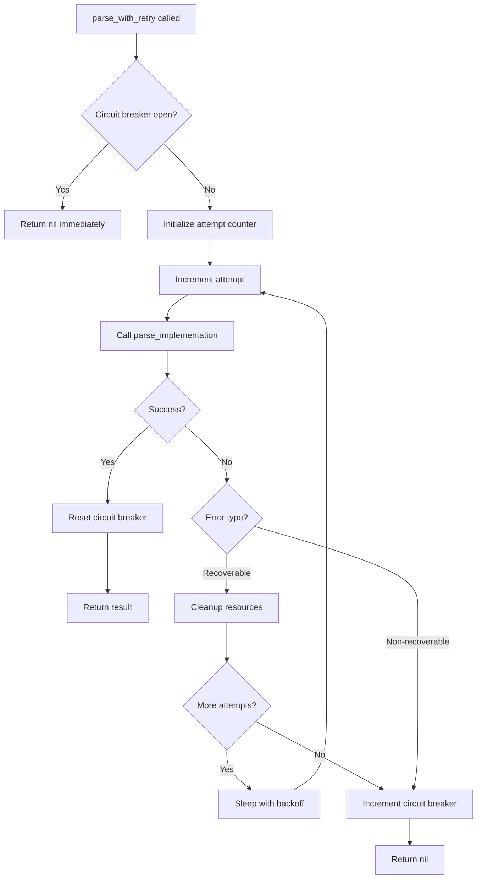

# TrackerDelivery Parser v5.0 API Reference

## Overview

This document provides comprehensive API reference for TrackerDelivery Parser System v5.0, focusing on the retry mechanisms, circuit breaker patterns, and parser service interfaces. All classes and methods are documented with examples, parameters, and return values.

## Core Classes

### RetryableParser

Base class providing retry mechanism, circuit breaker pattern, and resource management for all parser services.

```ruby
class RetryableParser
end
```

#### Constants

| Constant | Value | Description |
|----------|--------|-------------|
| `RETRY_DELAYS` | `[2, 4, 8].freeze` | Exponential backoff delays in seconds |
| `MAX_RETRIES` | `3` | Maximum number of retry attempts |
| `CIRCUIT_BREAKER_THRESHOLD` | `5` | Failures before circuit breaker opens |
| `CIRCUIT_BREAKER_RESET_TIME` | `30` | Seconds circuit breaker stays open |

#### Class Attributes

```ruby
class << self
  attr_accessor :circuit_breaker_failures, :circuit_breaker_opened_at
end
```

| Attribute | Type | Description |
|-----------|------|-------------|
| `circuit_breaker_failures` | Integer | Current failure count for circuit breaker |
| `circuit_breaker_opened_at` | Time/nil | Timestamp when circuit breaker opened |

#### Error Classification

**Recoverable Errors (trigger retry):**
```ruby
RECOVERABLE_ERRORS = [
  Selenium::WebDriver::Error::InvalidSessionIdError,
  Selenium::WebDriver::Error::WebDriverError,
  Selenium::WebDriver::Error::UnknownError,
  Selenium::WebDriver::Error::SessionNotCreatedError,
  Timeout::Error,
  Net::ReadTimeout,
  Net::OpenTimeout,
  Errno::ECONNREFUSED,
  Errno::ECONNRESET
].freeze
```

**Non-Recoverable Errors (immediate failure):**
```ruby
NON_RECOVERABLE_ERRORS = [
  Selenium::WebDriver::Error::NoSuchElementError,
  Selenium::WebDriver::Error::InvalidArgumentError,
  ArgumentError,
  URI::InvalidURIError
].freeze
```

### Public Methods

#### parse_with_retry(url)

Main entry point for parsing with retry mechanism and circuit breaker protection.

**Parameters:**
- `url` (String): The URL to parse

**Returns:**
- Hash: Parsed data if successful
- nil: If parsing fails or circuit breaker is open

**Raises:**
- None (all exceptions are caught and handled internally)

**Example:**
```ruby
parser = GrabParserService.new
result = parser.parse_with_retry("https://food.grab.com/id/en/restaurant/example")

if result
  puts "Success: #{result[:name]}"
else
  puts "Failed to parse restaurant data"
end
```

**Behavior:**
1. Checks if circuit breaker is open
2. Attempts parsing up to `MAX_RETRIES` times
3. Applies exponential backoff between retries
4. Manages circuit breaker state based on results
5. Cleans up resources between retry attempts

### Private Methods

#### parse_implementation(url)

Abstract method that must be implemented by subclasses. Contains the actual parsing logic.

**Parameters:**
- `url` (String): The URL to parse

**Returns:**
- Hash: Parsed data structure
- nil: If parsing fails

**Example Implementation:**
```ruby
def parse_implementation(url)
  driver = setup_chrome_driver
  @current_driver = driver
  
  driver.get(url)
  
  # Extract data
  {
    name: extract_name(driver),
    address: extract_address(driver),
    rating: extract_rating(driver)
  }
rescue => e
  Rails.logger.error "Parse error: #{e.message}"
  nil
ensure
  cleanup_local_resources
end
```

#### cleanup_driver_resources

Cleans up WebDriver resources between retry attempts. Must be implemented by subclasses.

**Parameters:** None

**Returns:** None

**Example Implementation:**
```ruby
def cleanup_driver_resources
  if @current_driver
    begin
      @current_driver.quit
    rescue => e
      Rails.logger.warn "Error closing driver: #{e.message}"
    ensure
      @current_driver = nil
    end
  end
end
```

#### parser_name

Returns a formatted name for the parser used in logging.

**Parameters:** None

**Returns:**
- String: Parser name (e.g., "Grab", "GoJek")

**Example:**
```ruby
parser_name  # => "Grab" (for GrabParserService)
```

### Circuit Breaker Methods

#### circuit_breaker_open?

Checks if the circuit breaker is currently open.

**Parameters:** None

**Returns:**
- Boolean: true if circuit breaker is open, false otherwise

**Example:**
```ruby
if parser.send(:circuit_breaker_open?)
  puts "Circuit breaker is open, service unavailable"
end
```

#### reset_circuit_breaker

Resets the circuit breaker to closed state. Called automatically on successful operations.

**Parameters:** None

**Returns:** None

**Side Effects:**
- Sets `circuit_breaker_failures` to 0
- Sets `circuit_breaker_opened_at` to nil
- Logs reset event

#### increment_circuit_breaker_failures

Increments failure count and opens circuit breaker if threshold reached.

**Parameters:** None

**Returns:** None

**Side Effects:**
- Increments `circuit_breaker_failures`
- Sets `circuit_breaker_opened_at` if threshold reached
- Logs failure events

## Parser Service Classes

### GrabParserService

Parser for Grab food delivery platform.

```ruby
class GrabParserService < RetryableParser
  TIMEOUT_SECONDS = 20
end
```

#### Public Methods

##### parse(url)

Main parsing method with retry mechanism.

**Parameters:**
- `url` (String): Grab restaurant URL

**Returns:**
- Hash: Restaurant data or nil

**Example:**
```ruby
service = GrabParserService.new
result = service.parse("https://food.grab.com/id/en/restaurant/warung-sate-kambing-jl-dipenogoro-jakarta")

# Result structure:
{
  name: "Warung Sate Kambing",
  address: "Jl. Dipenogoro No.123, Jakarta",
  rating: 4.5,
  cuisines: ["Indonesian", "Grilled"],
  operating_hours: "10:00 - 22:00",
  images: ["https://...", "https://..."],
  coordinates: {
    latitude: -6.123456,
    longitude: 106.123456
  }
}
```

### GojekParserService

Parser for GoFood (Gojek) food delivery platform.

```ruby
class GojekParserService < RetryableParser
  TIMEOUT_SECONDS = 60  # Extended for production server performance
end
```

#### Public Methods

##### parse(url)

Main parsing method with retry mechanism and production optimizations.

**Parameters:**
- `url` (String): GoFood restaurant URL

**Returns:**
- Hash: Restaurant data or nil

**Example:**
```ruby
service = GojekParserService.new
result = service.parse("https://gofood.co.id/jakarta/restaurant/warung-padang-sederhana")

# Result structure:
{
  name: "Warung Padang Sederhana",
  address: "Jl. Sudirman No.456, Jakarta",
  rating: "4.3",  # May be "NEW" for new restaurants
  cuisines: ["Padang", "Indonesian"],
  operating_hours: "08:00 - 21:00",
  images: ["https://...", "https://..."]
}
```

## Configuration and Environment

### Environment Variables

| Variable | Default | Description |
|----------|---------|-------------|
| `CHROME_BIN` | Auto-detect | Path to Chrome/Chromium binary |
| `CHROMEDRIVER_PATH` | Auto-detect | Path to ChromeDriver executable |
| `PARSER_TIMEOUT` | 20/60 | Parser timeout in seconds |
| `CIRCUIT_BREAKER_THRESHOLD` | 5 | Failures before circuit opens |
| `CIRCUIT_BREAKER_RESET_TIME` | 30 | Circuit breaker reset time |

### Chrome Configuration

Default Chrome options used by parsers:

```ruby
options = Selenium::WebDriver::Chrome::Options.new
options.add_argument('--headless')
options.add_argument('--no-sandbox')
options.add_argument('--disable-dev-shm-usage')
options.add_argument('--disable-gpu')
options.add_argument('--window-size=1920,1080')

# Production optimizations (GoJek parser)
options.add_argument('--disable-images')
options.add_argument('--disable-notifications')
options.add_argument('--aggressive-cache-discard')
```

## Monitoring and Health Checks

### Health Check Endpoints

#### GET /health

Basic application health check with circuit breaker status.

**Response:**
```json
{
  "status": "ok",
  "timestamp": "2024-09-20T10:30:00Z",
  "version": "5.0",
  "circuit_breaker": {
    "grab": {
      "failures": 0,
      "open": false
    },
    "gojek": {
      "failures": 0,
      "open": false
    }
  }
}
```

#### GET /health/parsers

Detailed parser health check with performance testing.

**Response:**
```json
{
  "grab": {
    "status": "ok",
    "duration": 5.87,
    "timestamp": "2024-09-20T10:30:00Z"
  },
  "gojek": {
    "status": "ok", 
    "duration": 5.5,
    "timestamp": "2024-09-20T10:30:00Z"
  }
}
```

**Error Response:**
```json
{
  "grab": {
    "status": "error",
    "error": "Timeout::Error",
    "message": "execution expired",
    "timestamp": "2024-09-20T10:30:00Z"
  }
}
```

### Circuit Breaker Monitoring

#### Manual Circuit Breaker Control

**Check Status:**
```ruby
# In Rails console or runner
puts "Grab failures: #{GrabParserService.circuit_breaker_failures}"
puts "Grab opened at: #{GrabParserService.circuit_breaker_opened_at}"
puts "GoJek failures: #{GojekParserService.circuit_breaker_failures}"
puts "GoJek opened at: #{GojekParserService.circuit_breaker_opened_at}"
```

**Reset Circuit Breaker:**
```ruby
# Reset Grab parser circuit breaker
GrabParserService.circuit_breaker_failures = 0
GrabParserService.circuit_breaker_opened_at = nil

# Reset GoJek parser circuit breaker  
GojekParserService.circuit_breaker_failures = 0
GojekParserService.circuit_breaker_opened_at = nil
```

## Logging and Debugging

### Log Levels and Messages

#### INFO Level
```
=== Attempt 1/3 for Grab ===
URL: https://food.grab.com/...
✅ Grab SUCCESS on attempt 1 (5.87s)
🔧 Circuit breaker RESET (was 2 failures)
```

#### WARN Level  
```
🔄 Grab RECOVERABLE ERROR on attempt 1 (3.45s)
   Error: Selenium::WebDriver::Error::InvalidSessionIdError - invalid session id
   ⏳ Waiting 2s before retry...
⚠️ Circuit breaker failure count: 3/5
```

#### ERROR Level
```
❌ Grab NON-RECOVERABLE ERROR on attempt 1 (1.23s)  
   Error: Selenium::WebDriver::Error::NoSuchElementError - element not found
❌ Grab FAILED after 3 attempts
   Last error: Timeout::Error - execution expired
🚨 Circuit breaker OPENED after 5 failures
   Will remain open for 30s
```

### Debug Mode

Enable detailed logging for troubleshooting:

```ruby
# In Rails console
Rails.logger.level = Logger::DEBUG

# Run parser with debug output
result = GrabParserService.new.parse("https://food.grab.com/...")
```

## Error Handling Patterns

### Retry Logic Flow



### Exception Handling Examples

**Recoverable Error Handling:**
```ruby
begin
  result = parse_implementation(url)
rescue Selenium::WebDriver::Error::InvalidSessionIdError => e
  # This will trigger retry mechanism
  Rails.logger.warn "Session lost, will retry: #{e.message}"
  cleanup_driver_resources
  raise e  # Re-raise to trigger retry
end
```

**Non-Recoverable Error Handling:**
```ruby
begin
  element = driver.find_element(:css, "invalid-selector")
rescue Selenium::WebDriver::Error::NoSuchElementError => e
  # This will cause immediate failure
  Rails.logger.error "Element not found, page structure changed: #{e.message}"
  raise e  # Re-raise, will not retry
end
```

## Performance Optimization

### Parser Configuration

**Grab Parser Optimizations:**
```ruby
class GrabParserService < RetryableParser
  TIMEOUT_SECONDS = 20
  
  private
  
  def setup_chrome_driver
    options = Selenium::WebDriver::Chrome::Options.new
    options.add_argument('--headless')
    options.add_argument('--disable-dev-shm-usage')
    options.add_argument('--no-sandbox')
    
    Selenium::WebDriver.for(:chrome, options: options)
  end
end
```

**GoJek Parser Production Optimizations:**
```ruby
class GojekParserService < RetryableParser
  TIMEOUT_SECONDS = 60  # Extended for production
  
  private
  
  def setup_chrome_driver
    options = Selenium::WebDriver::Chrome::Options.new
    options.add_argument('--headless')
    options.add_argument('--disable-images')        # Faster loading
    options.add_argument('--disable-notifications') # Less resource usage
    options.add_argument('--aggressive-cache-discard') # Memory optimization
    
    # Production server timeouts
    options.page_load_timeout = 45
    options.script_timeout = 30
    
    Selenium::WebDriver.for(:chrome, options: options)
  end
end
```

### Memory Management

**Resource Cleanup Pattern:**
```ruby
def parse_implementation(url)
  driver = nil
  begin
    driver = setup_chrome_driver
    @current_driver = driver  # Track for cleanup
    
    # Parsing logic here
    
  ensure
    # Local cleanup
    if driver
      begin
        driver.quit
      rescue => e
        Rails.logger.warn "Error closing driver: #{e.message}"
      end
    end
  end
end

def cleanup_driver_resources
  # Called by RetryableParser between retries
  if @current_driver
    begin
      @current_driver.quit
    rescue => e
      Rails.logger.warn "Error in cleanup: #{e.message}"
    ensure
      @current_driver = nil
    end
  end
end
```

## Testing and Validation

### Parser Testing

**Manual Testing:**
```ruby
# Test individual parser
service = GrabParserService.new
result = service.parse("https://food.grab.com/id/en/restaurant/test")
puts result.inspect

# Test with retry mechanism
3.times do |i|
  puts "Test #{i + 1}:"
  start_time = Time.current
  result = service.parse("https://food.grab.com/id/en/restaurant/test")
  duration = Time.current - start_time
  puts "  Duration: #{duration.round(2)}s"
  puts "  Success: #{!result.nil?}"
end
```

**Circuit Breaker Testing:**
```ruby
# Simulate failures to test circuit breaker
parser_class = GrabParserService

# Check initial state
puts "Initial failures: #{parser_class.circuit_breaker_failures}"

# Simulate failures
5.times do
  parser_class.send(:increment_circuit_breaker_failures)
  puts "Failures: #{parser_class.circuit_breaker_failures}"
end

# Test if circuit is open
puts "Circuit open?: #{parser_class.new.send(:circuit_breaker_open?)}"

# Reset and test
parser_class.new.send(:reset_circuit_breaker)
puts "After reset - failures: #{parser_class.circuit_breaker_failures}"
```

### Performance Testing

**Benchmark Multiple Restaurants:**
```ruby
urls = [
  "https://food.grab.com/id/en/restaurant/url1",
  "https://food.grab.com/id/en/restaurant/url2",
  "https://food.grab.com/id/en/restaurant/url3"
]

service = GrabParserService.new
results = []

urls.each_with_index do |url, index|
  start_time = Time.current
  result = service.parse(url)
  duration = Time.current - start_time
  
  results << {
    index: index + 1,
    url: url,
    success: !result.nil?,
    duration: duration.round(2)
  }
  
  puts "Restaurant #{index + 1}: #{duration.round(2)}s - #{result ? 'Success' : 'Failed'}"
end

# Calculate statistics
durations = results.select { |r| r[:success] }.map { |r| r[:duration] }
puts "Average duration: #{(durations.sum / durations.size).round(2)}s"
puts "Success rate: #{results.count { |r| r[:success] }}/#{results.size}"
```

This API reference provides comprehensive documentation for implementing, configuring, monitoring, and troubleshooting TrackerDelivery Parser System v5.0.