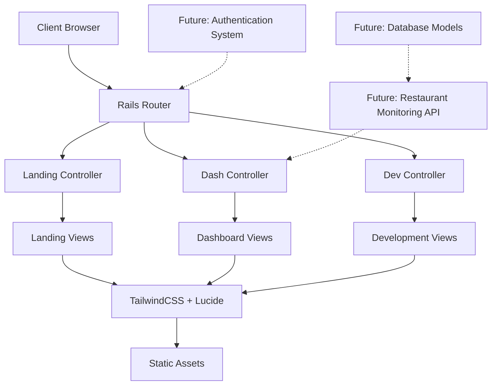

# TrackerDelivery Project Architecture v3.0
*Last Updated: September 13, 2024*

## 🏗️ Executive Summary

TrackerDelivery v3.0 features a streamlined Rails 8 architecture optimized for restaurant monitoring functionality. The architecture emphasizes simplicity, maintainability, and rapid feature development, with a clean separation between frontend presentation and planned backend monitoring services.

## 🎯 Architecture Philosophy

### Core Principles
- **Simplicity First**: Clean, maintainable codebase without premature optimization
- **UI-Driven Development**: Frontend-first approach with backend integration planned for v3.1
- **Business Focus**: Architecture designed specifically for B2B SaaS restaurant monitoring
- **Scalability Ready**: Foundation prepared for high-frequency monitoring and real-time alerts

### Design Decisions
- **Monolithic Rails Application**: Single deployable unit for operational simplicity
- **Static-First**: Current version serves as high-fidelity prototype with static data
- **Progressive Enhancement**: Architecture supports incremental backend feature addition
- **Mobile-First**: Responsive design architecture from ground up

## 🏛️ High-Level Architecture



## 📁 Application Structure

### Current Directory Structure
```
TrackerDelivery/
├── app/
│   ├── controllers/
│   │   ├── application_controller.rb
│   │   ├── landing_controller.rb
│   │   ├── dash_controller.rb
│   │   └── dev_controller.rb
│   ├── models/
│   │   └── application_record.rb
│   ├── views/
│   │   ├── landing/
│   │   ├── dash/
│   │   ├── dev/
│   │   └── layouts/
│   └── helpers/
├── config/
├── db/
│   └── (empty - post v3.0 cleanup)
├── ai_docs/
│   ├── business/
│   ├── development/
│   └── ui/
└── CLAUDE.md
```

### Key Architecture Components

#### 1. Controller Layer
**Current State**: Minimal controllers serving static content

```ruby
# Simplified controller architecture
class ApplicationController < ActionController::Base
  # Clean base controller without authentication complexity
  allow_browser versions: :modern
end

class LandingController < ApplicationController
  # Marketing and public pages
  def index; end
  def test; end
end

class DashController < ApplicationController
  # Restaurant monitoring dashboard
  def test; end      # Main landing for dash
  def dashboard; end # Monitoring interface
  def onboarding; end # Restaurant setup
end
```

#### 2. View Layer
**Architecture**: Component-based ERB templates with TailwindCSS

```
Views Architecture:
├── layouts/
│   └── application.html.erb (shared layout)
├── landing/
│   └── index.html.erb (marketing site)
├── dash/
│   ├── test.html.erb (dashboard landing)
│   ├── dashboard.html.erb (monitoring interface)
│   └── onboarding.html.erb (restaurant setup)
└── dev/
    └── (development versions)
```

#### 3. Frontend Architecture

**Technology Stack**:
- **TailwindCSS 4.x**: Utility-first CSS framework with custom configuration
- **Lucide Icons**: Comprehensive icon library with JavaScript initialization
- **Stimulus**: Hotwire JavaScript framework for interactive behaviors
- **Responsive Design**: Mobile-first approach with breakpoint strategy

**Tailwind Configuration**:
```javascript
tailwind.config = {
  theme: {
    extend: {
      colors: {
        primary: '#16A34A',        // Brand green
        'primary-dark': '#15803D', // Darker green
        'primary-light': '#4ADE80', // Lighter green
        'green-50': '#F0FDF4',     // Background tints
        'green-100': '#DCFCE7',
        'green-600': '#16A34A',
        'green-700': '#15803D',
      }
    }
  }
}
```

#### 4. Route Architecture

**Current Routes Structure**:
```ruby
Rails.application.routes.draw do
  # Marketing site
  root "landing#index"
  get "landing/index"
  get "index" => "landing#index"
  get "test" => "landing#test"
  
  # Dashboard interface  
  get "dash/test" => "dash#test"
  get "dash/dashboard" => "dash#dashboard"
  get "dash/onboarding" => "dash#onboarding"
  
  # Development environment
  get "dev/test" => "dev#test"
  get "dev/dashboard" => "dev#dashboard"
  get "dev/onboarding" => "dev#onboarding"
  
  # System routes
  get "up" => "rails/health#show", as: :rails_health_check
end
```

## 🗄️ Data Architecture

### Current State (v3.0)
**Database**: SQLite3 with empty schema post-authentication cleanup

```sql
-- Current database state
-- (Empty after v3.0 authentication removal)
-- Ready for v3.1 restaurant monitoring schema
```

### Planned Schema (v3.1+)

```sql
-- Planned database architecture for v3.1

-- Users table (authentication system redesign)
CREATE TABLE users (
  id INTEGER PRIMARY KEY,
  email VARCHAR(255) NOT NULL UNIQUE,
  name VARCHAR(255) NOT NULL,
  encrypted_password VARCHAR(255),
  created_at TIMESTAMP,
  updated_at TIMESTAMP
);

-- Restaurants table (core monitoring entities)
CREATE TABLE restaurants (
  id INTEGER PRIMARY KEY,
  user_id INTEGER REFERENCES users(id),
  name VARCHAR(255) NOT NULL,
  address TEXT,
  phone VARCHAR(50),
  cuisine_type VARCHAR(100),
  status VARCHAR(50) DEFAULT 'active',
  created_at TIMESTAMP,
  updated_at TIMESTAMP
);

-- Platform integrations (GrabFood, GoFood URLs)
CREATE TABLE platform_integrations (
  id INTEGER PRIMARY KEY,
  restaurant_id INTEGER REFERENCES restaurants(id),
  platform VARCHAR(100) NOT NULL, -- 'grabfood', 'gofood'
  platform_url TEXT NOT NULL,
  last_checked_at TIMESTAMP,
  status VARCHAR(50) DEFAULT 'active',
  created_at TIMESTAMP,
  updated_at TIMESTAMP
);

-- Monitoring alerts and notifications
CREATE TABLE alerts (
  id INTEGER PRIMARY KEY,
  restaurant_id INTEGER REFERENCES restaurants(id),
  alert_type VARCHAR(100) NOT NULL, -- 'offline', 'review', 'stock'
  severity VARCHAR(50) DEFAULT 'medium', -- 'low', 'medium', 'high'
  title VARCHAR(255) NOT NULL,
  description TEXT,
  resolved_at TIMESTAMP NULL,
  created_at TIMESTAMP,
  updated_at TIMESTAMP
);
```

## 🔧 Infrastructure Architecture

### Deployment Architecture
**Target Platform**: Kamal deployment on VPS/Cloud

```yaml
# Planned deployment architecture
Production Environment:
├── Application Server (Rails + Puma)
├── Database (PostgreSQL in production)
├── Background Jobs (Solid Queue)
├── Caching (Solid Cache)
├── WebSockets (Solid Cable)
└── Monitoring Services
    ├── Restaurant URL monitoring
    ├── Alert notification system
    └── Performance monitoring
```

### Development Environment
**Local Development Stack**:
```bash
# Current development tools
Rails 8.0.2.1              # Application framework
SQLite3                    # Development database
TailwindCSS 4.x           # CSS framework
Stimulus                  # JavaScript framework
RuboCop Rails Omakase     # Code quality
Brakeman                  # Security analysis
Foreman (bin/dev)         # Process management
```

## 🔒 Security Architecture

### Current Security Measures
- **Rails Security Defaults**: CSRF protection, secure headers
- **Brakeman Integration**: Automated security vulnerability scanning
- **Modern Browser Requirement**: Updated security features only
- **No Authentication Complexity**: Simplified attack surface

### Planned Security Enhancements (v3.1+)
- **JWT Authentication**: Modern, stateless authentication
- **API Rate Limiting**: Protection against monitoring service abuse
- **Input Validation**: Restaurant URL validation and sanitization
- **Secure Credential Storage**: Encrypted platform integration tokens
- **Audit Logging**: User action and system event tracking

## 📊 Performance Architecture

### Current Performance Characteristics
- **Static Content Serving**: Minimal server-side processing
- **Optimized Assets**: TailwindCSS purging, icon-based design
- **Modern Rails 8**: Optimized asset pipeline with Propshaft
- **Mobile-First Design**: Optimized for mobile performance

### Planned Performance Optimizations (v3.1+)
- **Background Job Processing**: Restaurant monitoring via Solid Queue
- **Caching Strategy**: Platform data caching with Solid Cache
- **Real-time Updates**: WebSocket notifications via Solid Cable
- **Database Optimization**: Indexed queries for monitoring data

## 🧪 Testing Architecture

### Current Testing Foundation
**Framework**: Rails 8 default testing with planned enhancements

```ruby
# Planned testing structure
test/
├── controllers/
│   ├── landing_controller_test.rb
│   ├── dash_controller_test.rb
│   └── dev_controller_test.rb
├── models/
│   ├── user_test.rb (v3.1+)
│   ├── restaurant_test.rb (v3.1+)
│   └── alert_test.rb (v3.1+)
├── integration/
│   ├── restaurant_monitoring_test.rb (v3.1+)
│   └── notification_system_test.rb (v3.1+)
└── system/
    ├── dashboard_navigation_test.rb
    └── restaurant_onboarding_test.rb
```

### Testing Strategy
- **Unit Tests**: Model logic and business rules
- **Controller Tests**: Request/response behavior
- **Integration Tests**: Cross-component functionality
- **System Tests**: End-to-end user workflows
- **Performance Tests**: Monitoring system load testing

## 🔄 API Architecture (Planned v3.1+)

### Internal API Structure
```ruby
# Planned API architecture for monitoring services

# Restaurant monitoring API
class RestaurantMonitoringService
  # Check restaurant status across platforms
  def check_restaurant_status(restaurant)
    # Platform-specific monitoring logic
  end
  
  # Generate alerts based on status changes
  def process_status_changes(restaurant, status_data)
    # Alert generation and notification logic
  end
end

# Notification service
class NotificationService
  # Send notifications via multiple channels
  def send_alert(alert, channels = [:email, :whatsapp])
    # Multi-channel notification delivery
  end
end
```

### External API Integrations
- **Platform Monitoring**: Web scraping for GrabFood/GoFood status
- **Notification Services**: WhatsApp/Telegram API integration
- **Email Services**: Transactional email for alerts
- **SMS Services**: Critical alert backup delivery

## 🔮 Future Architecture Evolution

### Version Roadmap

#### v3.1 (October 2024): Backend Foundation
- Authentication system implementation
- Restaurant and user models
- Basic monitoring service
- Alert notification system

#### v3.2 (November 2024): Real-time Monitoring  
- Background job processing
- WebSocket real-time updates
- Platform integration APIs
- Performance monitoring

#### v3.3 (December 2024): Advanced Features
- Multi-restaurant management
- Advanced alert configuration
- Analytics and reporting
- Mobile app preparation

#### v3.4 (January 2025): Scale & Optimize
- Performance optimization
- Horizontal scaling preparation
- Advanced caching strategies
- API rate limiting

#### v3.5 (February 2025): Production Ready
- Full production deployment
- Monitoring and observability
- Backup and disaster recovery
- Customer onboarding automation

### Scaling Considerations
- **Database Scaling**: PostgreSQL with read replicas
- **Application Scaling**: Horizontal Rails application scaling
- **Monitoring Scaling**: Distributed monitoring services
- **Notification Scaling**: Queue-based notification processing

## 📋 Development Guidelines

### Code Organization Principles
- **Convention over Configuration**: Rails defaults where possible
- **Single Responsibility**: Clear separation of concerns
- **Test-Driven Development**: Comprehensive test coverage
- **Documentation First**: Architecture decisions documented

### Quality Standards
- **RuboCop Compliance**: Rails Omakase configuration
- **Security First**: Brakeman passing, security review process
- **Performance Monitoring**: Response time and resource usage tracking
- **Accessibility Standards**: WCAG compliance for all interfaces

### Development Workflow
```bash
# Standard development workflow
1. Feature branch creation
2. TDD implementation
3. RuboCop and Brakeman passing
4. Manual testing across breakpoints
5. Code review and documentation
6. Integration testing
7. Deployment and monitoring
```

## 🎯 Success Metrics

### Technical Metrics
- **Code Quality**: RuboCop compliance > 98%
- **Security**: Zero Brakeman vulnerabilities
- **Performance**: Page load < 2s, API response < 500ms
- **Uptime**: > 99.9% availability target
- **Test Coverage**: > 90% line coverage

### Business Metrics
- **User Experience**: Dashboard interaction time < 30s
- **Monitoring Accuracy**: > 99% platform status accuracy
- **Alert Reliability**: < 30s notification delivery
- **System Scalability**: Support 1000+ restaurants

## 📚 Documentation & Resources

### Architecture Documentation
- **Current Document**: `/ai_docs/development/project_architecture_v3.md`
- **UI Design System**: `/ai_docs/ui/ui_design_system.md`
- **Business Strategy**: `/ai_docs/business/gtm_manifest.md`
- **Development Guide**: `/CLAUDE.md`

### External Resources
- **Rails 8 Guides**: https://guides.rubyonrails.org/
- **TailwindCSS Documentation**: https://tailwindcss.com/docs
- **Lucide Icons**: https://lucide.dev/
- **Kamal Deployment**: https://kamal-deploy.org/

---

TrackerDelivery v3.0 architecture provides a solid foundation for rapid feature development while maintaining simplicity and maintainability. The architecture supports the business vision of comprehensive restaurant monitoring while preparing for scale and advanced features in future versions.