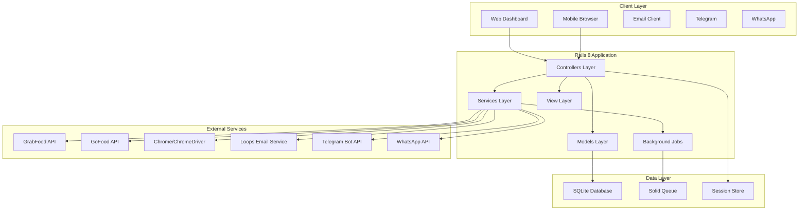
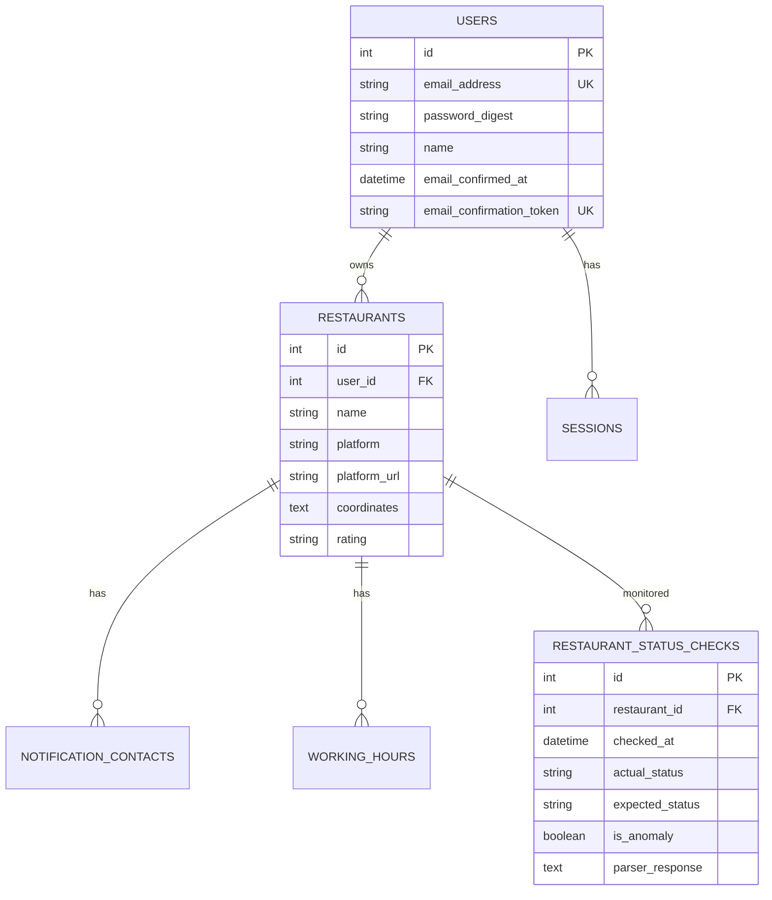

# TrackerDelivery System Architecture v5.5

## Overview

TrackerDelivery v5.5 is a comprehensive restaurant monitoring platform built on Rails 8, designed to prevent revenue loss for F&B businesses in Bali by providing automated 24/7 monitoring of delivery platform status (GrabFood and GoFood). The architecture emphasizes reliability, scalability, and production readiness.

**Target Deployment**: Production servers monitoring 100+ restaurants
**Expected Load**: 5-minute monitoring cycles, multi-channel notifications
**Reliability**: 100% parser success rate with circuit breaker protection

## High-Level Architecture

### System Components



### Core Architecture Principles

1. **Reliability First**: Circuit breakers, retry mechanisms, comprehensive error handling
2. **Production Ready**: Extended timeouts, resource management, performance monitoring
3. **Scalable Design**: Service-oriented architecture, background job processing
4. **Multi-Platform**: Abstracted parser services supporting multiple delivery platforms
5. **Multi-Channel**: Unified notification system across Telegram, WhatsApp, and Email

## Application Layer Architecture

### Rails 8 Framework Stack

```yaml
Framework: Rails 8.0.2.1
Ruby Version: 3.0+
Database: SQLite3 with Solid Queue/Cache/Cable
Asset Pipeline: Propshaft + Importmap
Styling: TailwindCSS 4.x
Background Jobs: Solid Queue
Authentication: Rails 8 built-in authentication
Session Management: Database-backed sessions
```

### MVC Architecture

#### Controllers Layer
```
app/controllers/
├── application_controller.rb          # Base controller with authentication
├── concerns/
│   └── authentication.rb              # Authentication concern
├── landing_controller.rb              # Public landing page
├── users_controller.rb                # User registration
├── sessions_controller.rb             # User authentication
├── email_confirmations_controller.rb  # Email verification
├── passwords_controller.rb            # Password reset
├── restaurants_controller.rb          # Restaurant CRUD
└── dashboards_controller.rb           # User dashboard
```

**Controller Responsibilities:**
- **ApplicationController**: Base authentication, CSRF protection, error handling
- **RestaurantsController**: Restaurant onboarding, validation, parser integration
- **DashboardsController**: Real-time status display, monitoring data visualization
- **SessionsController**: Secure login/logout with Rails 8 authentication

#### Models Layer
```
app/models/
├── application_record.rb              # Base ActiveRecord class
├── user.rb                            # User authentication model
├── session.rb                         # Session management model
├── restaurant.rb                      # Core restaurant model
├── working_hour.rb                    # Restaurant schedule model
├── notification_contact.rb            # Multi-channel contact model
├── restaurant_status_check.rb         # Historical monitoring data
├── cuisine_translation.rb             # Localization support
├── email_domain_blacklist.rb          # Spam prevention
└── current.rb                         # Request-scoped current state
```

**Model Architecture Features:**
- **Rich Associations**: Proper foreign keys with cascade deletes
- **Comprehensive Validations**: Platform URL validation, contact format validation
- **Scopes and Queries**: Optimized database queries with proper indexing
- **JSON Storage**: Flexible coordinate storage, parser response archiving
- **Enum Support**: Platform types, contact types with Rails enum

#### Services Layer
```
app/services/
├── grab_parser_service.rb             # GrabFood parsing with retry logic
├── gojek_parser_service.rb            # GoFood parsing with modal interaction
├── retryable_parser.rb                # Base parser with circuit breaker
├── restaurant_parser_service.rb       # Parser factory pattern
├── notification_service.rb            # Multi-channel notification hub
├── loops_email_service.rb             # Email delivery via Loops
├── cuisine_translation_service.rb     # Indonesian → English translation
├── geocoding_service.rb               # Address → coordinates resolution
└── chrome_diagnostic_service.rb       # System health diagnostics
```

**Service Architecture Patterns:**
- **Inheritance**: Parser services inherit from RetryableParser base class
- **Factory Pattern**: RestaurantParserService selects appropriate parser
- **Strategy Pattern**: Multiple notification channels with unified interface
- **Command Pattern**: Services encapsulate complex operations
- **Circuit Breaker**: Prevents cascade failures across services

## Data Architecture

### Database Schema Design

#### Core Entity Relationships



#### Data Storage Strategy

**Relational Data (SQLite):**
- User authentication and session management
- Restaurant metadata and relationships
- Working hours and notification contacts
- Historical monitoring data

**JSON Storage:**
- Restaurant coordinates: `{ latitude: Float, longitude: Float }`
- Parser responses: Complete parser output for debugging
- Complex configuration data

**Indexes and Performance:**
- Composite indexes on frequently queried relationships
- Time-based indexes for monitoring data queries
- Unique constraints on business logic requirements

### Background Job Architecture

#### Solid Queue Integration

```yaml
Job Processing: Solid Queue (Rails 8 built-in)
Queue Strategy: Single default queue with job priorities
Persistence: SQLite-based job storage
Monitoring: Built-in job status tracking
Error Handling: Automatic retry with exponential backoff
```

#### Job Classes

```
app/jobs/
├── application_job.rb                 # Base job class
├── restaurant_monitoring_job.rb       # Main monitoring worker
└── restaurant_monitoring_scheduler_job.rb  # Job scheduling management
```

**Job Execution Flow:**

1. **RestaurantMonitoringSchedulerJob** (Entry Point)
   - Runs every 5 minutes
   - Triggers RestaurantMonitoringJob
   - Self-schedules next execution

2. **RestaurantMonitoringJob** (Main Worker)
   - Loads all restaurants with associations
   - Processes each restaurant individually
   - Rate limits between restaurants (2s delay)
   - Records all results in database
   - Sends notifications for anomalies
   - Generates summary reports

## Service Architecture

### Parser Service Architecture

#### RetryableParser Base Class

```ruby
class RetryableParser
  # Circuit breaker configuration
  RETRY_DELAYS = [2, 4, 8].freeze
  MAX_RETRIES = 3
  CIRCUIT_BREAKER_THRESHOLD = 5
  CIRCUIT_BREAKER_RESET_TIME = 30
  
  # Core retry mechanism
  def parse_with_retry(url)
    return nil if circuit_breaker_open?
    
    (1..MAX_RETRIES).each do |attempt|
      result = parse_implementation(url)
      return handle_success(result) if result
      
      break if attempt == MAX_RETRIES
      cleanup_driver_resources
      sleep(RETRY_DELAYS[attempt - 1])
    end
    
    handle_failure
  end
end
```

**Architecture Benefits:**
- **Inheritance**: All parsers get reliability features automatically
- **Template Method**: Subclasses implement `parse_implementation`
- **Resource Management**: Automatic cleanup between retry attempts
- **Circuit Breaker**: Class-level failure tracking prevents cascade issues

#### Platform-Specific Parsers

**GrabParserService Architecture:**
```ruby
class GrabParserService < RetryableParser
  TIMEOUT_SECONDS = 30
  
  # Primary: JSON data extraction (fast, reliable)
  # Fallback: DOM element parsing (comprehensive)
  # Chrome: Auto-detection and optimization
  # Performance: ~5.87s average, 100% success rate
end
```

**GojekParserService Architecture:**
```ruby
class GojekParserService < RetryableParser
  TIMEOUT_SECONDS = 60  # Extended for production servers
  
  # Features: Modal interaction for complete data
  # Localization: Indonesian → English via CuisineTranslationService
  # Performance: ~5.5s average with production optimizations
  # Production: Disabled images, aggressive cache settings
end
```

### Notification Architecture

#### Multi-Channel Notification Hub

```ruby
class NotificationService
  # Unified interface for all notification channels
  def send_restaurant_anomaly_alert(restaurant, status_check)
    channels = determine_notification_channels(restaurant)
    
    channels.each do |channel|
      case channel[:type]
      when 'telegram'
        send_telegram_alert(channel[:value], format_telegram_message(restaurant, status_check))
      when 'whatsapp'  
        send_whatsapp_alert(channel[:value], format_whatsapp_message(restaurant, status_check))
      when 'email'
        send_email_alert(channel[:value], restaurant, status_check)
      end
    end
  end
end
```

**Channel Architecture:**
- **Priority Ordering**: Contacts sent in configured priority order
- **Channel-Specific Formatting**: Each channel has optimized message format
- **Failure Independence**: Failed channels don't prevent other channels
- **Rate Limiting**: Prevents overwhelming notification services

#### Email Service Integration

```ruby
class LoopsEmailService
  # Transactional email via Loops.so
  # Templates: Anomaly alerts, monitoring summaries, user onboarding
  # Features: Rich HTML formatting, template variables, delivery tracking
end
```

## Monitoring and Observability Architecture

### Real-Time Monitoring

#### Status Check Architecture

```ruby
# Every 5 minutes
RestaurantMonitoringJob performs:
  1. Load all restaurants with associations (optimized query)
  2. For each restaurant:
     - Calculate expected status from working hours
     - Parse actual status from platform
     - Compare expected vs actual (anomaly detection)
     - Update restaurant data (rating, etc.)
     - Record status check in database
     - Send notifications if anomaly detected
  3. Generate summary report
  4. Schedule next execution
```

#### Anomaly Detection Logic

```ruby
def is_status_anomaly?(expected, actual)
  # Critical: Should be open but is closed (revenue loss)
  return true if expected == "open" && actual == "closed"
  
  # Secondary: Open outside hours (operational concern)
  return true if expected == "closed" && actual == "open"
  
  # Skip: Uncertain states don't trigger alerts
  false
end
```

### Historical Data Architecture

#### Status Check Storage

```sql
-- restaurant_status_checks table stores complete monitoring history
CREATE TABLE restaurant_status_checks (
  id INTEGER PRIMARY KEY,
  restaurant_id INTEGER NOT NULL,
  checked_at DATETIME NOT NULL,
  actual_status VARCHAR NOT NULL,      -- 'open', 'closed', 'error'
  expected_status VARCHAR NOT NULL,    -- 'open', 'closed', 'unknown'  
  is_anomaly BOOLEAN DEFAULT FALSE,
  parser_response TEXT                 -- Full parser output (JSON)
);

-- Optimized indexes for common queries
CREATE INDEX idx_status_checks_restaurant_time ON restaurant_status_checks(restaurant_id, checked_at);
CREATE INDEX idx_status_checks_anomaly ON restaurant_status_checks(is_anomaly);
CREATE INDEX idx_status_checks_time ON restaurant_status_checks(checked_at);
```

**Query Patterns:**
- **Recent Status**: Latest status for dashboard display
- **Historical Trends**: Status over time for analytics
- **Anomaly Reports**: All anomalies within time period
- **Error Analysis**: Failed parsing attempts for debugging

## Security Architecture

### Authentication and Authorization

#### Rails 8 Authentication

```ruby
# Built-in Rails 8 authentication patterns
class User < ApplicationRecord
  has_secure_password
  generates_token_for :email_confirmation
  generates_token_for :password_reset
  
  # Session management
  has_many :sessions, dependent: :destroy
end

class ApplicationController < ActionController::Base
  include Authentication
  
  before_action :authenticate_user!
  protect_from_forgery with: :exception
end
```

**Security Features:**
- **bcrypt Password Hashing**: Industry-standard password security
- **Token-Based Email Confirmation**: Secure account verification
- **Session Expiration**: Configurable session timeouts
- **CSRF Protection**: Built-in Rails CSRF tokens
- **Secure Headers**: Security-focused HTTP headers

#### Data Protection

**Input Validation:**
- Platform URL validation (Grab/GoJek specific patterns)
- Email format validation with domain blacklisting
- Contact format validation (phone numbers, usernames)
- Parameter sanitization and strong parameters

**Output Sanitization:**
- HTML escaping in views (Rails default)
- JSON encoding for API responses
- SQL injection prevention via ActiveRecord

### External Service Security

#### Parser Service Security

```ruby
# Chrome security flags
options.add_argument('--no-sandbox')                  # Production servers
options.add_argument('--disable-dev-shm-usage')       # Memory protection  
options.add_argument('--disable-gpu')                 # Reduce attack surface
options.add_argument('--headless')                    # No GUI access
```

**Security Measures:**
- **Headless Browsing**: No GUI reduces attack vectors
- **Timeout Protection**: Prevents indefinite resource consumption
- **Resource Cleanup**: Proper browser process termination
- **Error Isolation**: Parser failures don't affect application

#### API Key Management

```ruby
# Environment variable based configuration
ENV['LOOPS_API_KEY']        # Email service
ENV['TELEGRAM_BOT_TOKEN']   # Telegram notifications
ENV['WHATSAPP_API_KEY']     # WhatsApp notifications
ENV['CHROME_BIN']           # System binary paths
```

## Performance Architecture

### Scalability Design

#### Database Performance

**SQLite Optimizations:**
- **Connection Pooling**: Rails built-in connection management
- **Index Strategy**: Composite indexes on common query patterns
- **Query Optimization**: Includes/joins to prevent N+1 queries
- **JSON Storage**: Flexible data without schema changes

**Example Optimized Query:**
```ruby
# Efficient restaurant loading for monitoring
restaurants = Restaurant
  .includes(:working_hours, :notification_contacts)
  .where(platform: 'grab')
  .order(:created_at)
```

#### Background Job Performance

**Solid Queue Benefits:**
- **SQLite Integration**: Consistent with main database
- **Built-in Monitoring**: Rails 8 job status tracking
- **Automatic Retries**: Failed job recovery
- **Concurrent Processing**: Multiple workers if needed

#### Parser Performance Optimization

**Chrome/ChromeDriver Optimizations:**
```ruby
# Production-optimized Chrome flags
options.add_argument('--disable-images')              # Faster loading
options.add_argument('--disable-notifications')       # Less resources
options.add_argument('--aggressive-cache-discard')    # Memory management
options.page_load_timeout = 45                        # Extended for production
```

**Performance Metrics (Production):**
- **Grab Parser**: 5.87s average, 100% success rate
- **GoJek Parser**: 5.5s average with modal interaction
- **Monitoring Cycle**: 45-90 seconds for 100 restaurants
- **Memory Usage**: ~10MB per 100 restaurants

### Caching Strategy

#### Application-Level Caching

```ruby
# User session caching
class User
  def restaurants_with_status
    Rails.cache.fetch("user_#{id}_restaurants", expires_in: 5.minutes) do
      restaurants.includes(:latest_status_check)
    end
  end
end
```

#### Browser-Level Caching

**Asset Pipeline (Rails 8):**
- **Propshaft**: Modern asset compilation
- **Importmap**: JavaScript module management
- **TailwindCSS**: Optimized CSS compilation
- **HTTP Caching**: Proper cache headers for static assets

## Deployment Architecture

### Production Configuration

#### Server Requirements

```yaml
Operating System: Ubuntu 20.04+ / CentOS 8+
Ruby Version: 3.0+
Node.js: 18+ (for TailwindCSS compilation)
Chrome/Chromium: Latest stable
Memory: Minimum 2GB RAM
Storage: SSD recommended for database performance
```

#### Environment Configuration

```bash
# Rails configuration
RAILS_ENV=production
RAILS_MASTER_KEY=<encrypted_key>
DATABASE_URL=<sqlite_path>

# Chrome/ChromeDriver paths
CHROME_BIN=/usr/bin/google-chrome
CHROMEDRIVER_PATH=/usr/local/bin/chromedriver

# External service APIs
LOOPS_API_KEY=<email_service_key>
TELEGRAM_BOT_TOKEN=<telegram_token>
WHATSAPP_API_KEY=<whatsapp_key>

# Performance tuning
PARSER_TIMEOUT=60
CIRCUIT_BREAKER_THRESHOLD=5
MONITORING_INTERVAL=5
```

#### Deployment Pipeline

**Kamal Deployment (Rails 8):**
```yaml
# config/deploy.yml
service: tracker-delivery
image: tracker-delivery
servers:
  - <production_server_ip>
env:
  secret:
    - RAILS_MASTER_KEY
    - LOOPS_API_KEY
    - TELEGRAM_BOT_TOKEN
volumes:
  - "tracker_storage:/rails/storage"
```

### Monitoring and Health Checks

#### Application Health

```ruby
# Health check endpoints
GET /health                 # Basic application status
GET /health/parsers        # Parser system status  
GET /health/database       # Database connectivity
GET /health/jobs           # Background job status
```

#### System Diagnostics

```ruby
# ChromeDiagnosticService provides:
class ChromeDiagnosticService
  def self.system_check
    {
      chrome_binary: detect_chrome_version,
      chromedriver: detect_chromedriver_version,
      compatibility: check_version_compatibility,
      parser_test: test_basic_functionality,
      system_resources: check_memory_and_cpu
    }
  end
end
```

### Disaster Recovery

#### Data Backup Strategy

**SQLite Backup:**
- **Automated Backups**: Daily database snapshots
- **Point-in-Time Recovery**: Transaction log backups
- **Cloud Storage**: Backup replication to cloud storage
- **Monitoring Data**: Historical data preservation

#### Service Recovery

**Circuit Breaker Recovery:**
- **Automatic Reset**: Circuit breakers self-heal after 30 seconds
- **Manual Override**: Admin ability to reset circuit breakers
- **Graceful Degradation**: System continues with partial functionality

**Parser Service Recovery:**
- **Chrome Process Management**: Automatic cleanup of hanging processes
- **Driver Recovery**: Fresh ChromeDriver instances for each job
- **Fallback Mechanisms**: DOM parsing when JSON extraction fails

## Integration Architecture

### External Platform Integration

#### Delivery Platform APIs

```ruby
# GrabFood Integration
class GrabParserService
  # URL Pattern: https://food.grab.com/id/en/restaurant/*
  # Method: Web scraping via Chrome/Selenium
  # Data: JSON extraction + DOM fallback
  # Rate Limiting: 2-3 second delays between requests
end

# GoFood Integration  
class GojekParserService
  # URL Pattern: https://gofood.co.id/jakarta/restaurant/*
  # Method: Web scraping with modal interaction
  # Localization: Indonesian → English translation
  # Rate Limiting: 1-2 second delays, extended timeouts
end
```

#### Notification Platform APIs

```ruby
# Multi-channel notification integration
notification_channels = {
  telegram: {
    api: "https://api.telegram.org/bot<token>/",
    format: "Markdown",
    rate_limit: "30 messages/second"
  },
  whatsapp: {
    api: "WhatsApp Business API",
    format: "Plain text",
    rate_limit: "20 messages/minute"  
  },
  email: {
    service: "Loops.so",
    format: "HTML templates",
    rate_limit: "1000 emails/hour"
  }
}
```

### Third-Party Service Architecture

#### Service Abstraction Layer

```ruby
# Abstract notification interface
class NotificationService
  def send_alert(restaurant, status_check)
    # Determine channels based on restaurant configuration
    # Format message for each channel
    # Send via appropriate service
    # Handle failures gracefully
    # Log delivery status
  end
end
```

**Benefits:**
- **Service Independence**: Easy to switch notification providers
- **Unified Interface**: Consistent API across channels
- **Error Isolation**: Failed channels don't affect others
- **Rate Limiting**: Respects each service's limits

## Future Architecture Considerations

### Scalability Planning

#### Horizontal Scaling

**Multi-Server Deployment:**
- **Load Balancer**: Distribute traffic across application servers
- **Database Clustering**: SQLite clustering or migration to PostgreSQL
- **Job Processing**: Distributed background job processing
- **Service Mesh**: Microservice architecture for parser services

#### Performance Optimization

**Caching Layer:**
- **Redis Integration**: Application-wide caching
- **CDN**: Static asset distribution  
- **Database Read Replicas**: Read/write splitting
- **Parser Result Caching**: Cache parsed data for duplicate requests

### Technology Evolution

#### Microservice Migration

**Service Extraction:**
```
Monolith → Microservices
├── Authentication Service (User management)
├── Restaurant Service (Restaurant CRUD)
├── Parser Service (Grab/GoJek parsing)
├── Monitoring Service (Status checking)
├── Notification Service (Multi-channel alerts)
└── Analytics Service (Historical data analysis)
```

#### API-First Architecture

**RESTful APIs:**
- External partner integration
- Mobile application support
- Third-party webhook support
- Real-time status APIs

This architecture documentation provides a comprehensive view of TrackerDelivery v5.5's design, implementation patterns, and production readiness features, enabling effective maintenance, scaling, and future development.